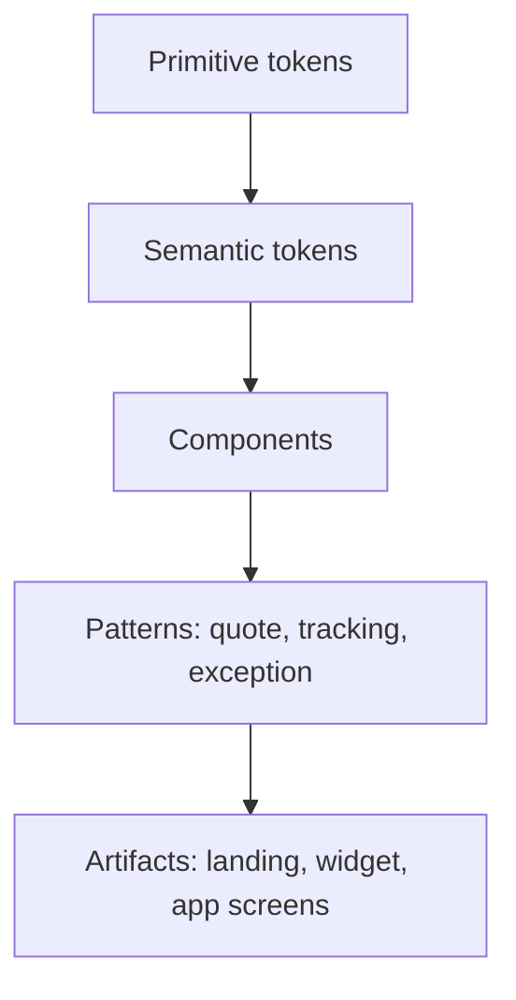
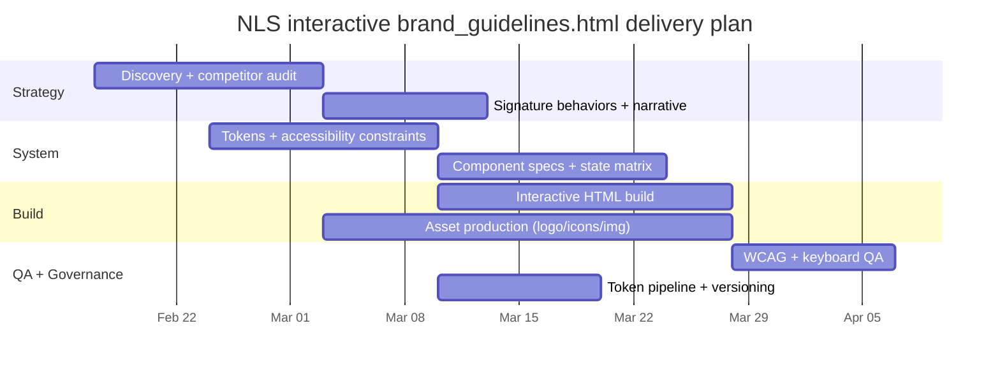

# NLS Digital-First Brand Guidelines Update for Annex Brands

## Executive summary

NLS is entering a space where competitors already promise “quote fast, ship safely, track clearly.” Arta positions itself as “Simplified Commerce for Collectibles” and explicitly emphasizes configurability and white-label experiences (e.g., a “brand studio” for tracking pages plus JavaScript widgets and APIs). citeturn7view0 The Packengers similarly markets “instant quote, book, and pay online” and real-time tracking, and it foregrounds API/widget integration with developer-facing examples. citeturn9view1 In other words, the competitive bar is not merely brand “look and feel,” but productized digital trust signals (widgets, APIs, tracking UX) and proof of operational rigor.

To outshine both competitors, NLS should differentiate on **recognizable digital behavior**, not just visuals: a signature “status-first” UI language (tracking milestones, exceptions, and verification cues that read in seconds), enforced through **design tokens** and **accessibility constraints** that remain stable regardless of channel. This approach is grounded in entity["organization","W3C","web standards consortium"]’s accessibility and semantics standards, especially WCAG 2.1 contrast, focus, and reflow requirements, because elite digital brands increasingly compete on legibility, reliability, and speed under real-world constraints (mobile, glare, low-vision, keyboard-only, reduced-motion). citeturn12search5turn12search15turn12search16turn13search0

A complete **interactive** `brand_guidelines.html` is included as a build-ready deliverable: it demonstrates variable-font typography, tokenized palettes, a live contrast checker, iconography via inline SVG symbols, motion controls with reduced-motion support, grid overlays, core UI components, and sample artifacts—all in a single file with embedded CSS/JS. This is meant to become the “auditable source of truth” for brand behavior and developer handoff.

**Download the interactive showcase (single-file HTML):**  
[Download brand_guidelines.html](sandbox:/mnt/data/brand_guidelines.html)

### Prioritized missing elements to verify against the initial proposal

Because the “initial proposal” is unspecified, the list below captures the **highest-risk omissions** that commonly prevent a brand guide from functioning as a digital-first system. Each item is framed as “validate whether present; if missing, add.”

| Priority | Likely missing element | Why it matters in a digital-first division | What must be added to `brand_guidelines.html` |
|---|---|---|---|
| P0 | Token governance + naming conventions | Without tokens and naming/aliasing rules, teams drift; competitors already ship “brandable” widget experiences. citeturn7view0turn14search1turn14search5 | Token schema (CTI or DTCG-aligned), semantic alias layer, versioning rules, export formats (CSS/JSON). citeturn14search1turn14search5turn4search1 |
| P0 | Accessibility targets and test method | WCAG AA is table-stakes; AA+ is a differentiator for trust and enterprise credibility. citeturn12search5turn12search15turn12search9turn13search0 | Explicit WCAG alignment (contrast, focus visibility, reflow, use-of-color, non-text contrast) + live contrast tool and component a11y notes. citeturn12search5turn12search15turn12search16turn12search9turn13search0 |
| P0 | Component states (hover/focus/disabled/error/loading) | Missing states produce inconsistent UX and accessibility failures (especially focus visibility). citeturn12search15turn12search14 | A component inventory with state matrix, keyboard behavior notes, and “do/don’t” rules. citeturn12search15turn13search0 |
| P1 | Dark mode + accessible variants | Digital-first experiences increasingly require theme support; contrast often breaks when simply inverting colors. citeturn12search5turn12search9 | Dual theme tokens (light/dark), accessible link color in light mode, and rules for where accent colors may be used as text. citeturn12search5turn0search0 |
| P1 | Motion guidance (durations/easing + reduced motion) | Motion can be a differentiator, but must remain usable and respectful of user preferences. citeturn1search12turn1search7 | Tokenized durations/easings, micro-interaction patterns, and reduced-motion fallbacks. citeturn1search7turn1search12 |
| P1 | Image and export pipeline (AVIF/WebP, responsive images, SVG optimization) | Brand imagery that is slow or unstable undermines trust; responsive image techniques reduce CLS and wasted bandwidth. citeturn5search0turn5search2turn11search0turn11search2turn11search6 | `<picture>` examples, format guidance, width/height guidance, and SVG optimization workflow (SVGO). citeturn5search2turn11search0turn11search6 |
| P2 | Tone of voice + UX copy patterns | Competitors already communicate clearly; NLS must sound like a system (precise, calm, accountable). citeturn9view1turn7view0 | UI copy “templates”: buttons, errors, statuses, notifications, SLAs, empty states. |
| P2 | Measurement framework | Without metrics, the brand cannot prove it outperforms competitors digitally (“outshine” must be measurable). citeturn4search0 | Performance/accessibility baselines + adoption and consistency metrics tied to tokens/components. citeturn4search0turn12search5 |

## Competitive landscape and differentiation opportunities

Arta and The Packengers both compete on **logistics confidence** and **integration readiness**, not only “branding.” For NLS, the winning move is to define a distinctive, repeatable experience across marketing, onboarding, quoting, tracking, and exception resolution—where the UI itself communicates operational rigor.

### Competitive observations grounded in primary sources

Arta’s homepage stakes a claim on “ship, insure, & track” for art/luxury/collectibles, and it highlights configurability and brandability: it calls out a “brand studio” to style tracking pages and offers JavaScript widgets plus an API for integration. citeturn7view0 Arta also foregrounds enterprise credibility with “Trusted by World Class Organizations” and extensive social proof blocks. citeturn7view0

The Packengers markets speed and simplicity (“one click”), with an emphasis on instant quoting, online booking/payment, and real-time tracking. citeturn9view1 It also explicitly promotes widget and API integration tooling and shows a developer-style code example for creating orders and invoices—an indicator that they are treating the product as a platform, not just a service. citeturn9view1

### Implications for NLS

Because both competitors already communicate “integration + tracking,” NLS should avoid a commodity message like “simple shipping.” Instead, the differentiation should be:

- **A signature “status language”**: a recognizable way NLS shows milestones, confidence, exceptions, and next actions—designed for scan speed and cross-channel consistency (marketing → app → notifications).
- **A more rigorous accessibility posture**: treating WCAG 2.1 AA as baseline and “AA+” as a brand promise (especially around contrast, focus visibility, and non-text contrast in status UI). citeturn12search5turn12search15turn12search9turn13search0
- **A token-governed system** that makes “brandability” a controlled, safe surface (competitors already offer white-labeling; NLS must offer it without breaking contrast, state cues, or reflow). citeturn14search1turn14search5

## Brand system strategy for a distinctive NLS digital experience

### Typography strategy

NLS should adopt **variable, screen-optimized fonts** to enable precise hierarchy tuning (especially in dense dashboards and tracking timelines) while maintaining performance and licensing clarity.

A strong, low-risk pairing is:

- **Body/UI:** Inter (variable; designed for screens) citeturn3search15  
- **Headings/Display:** Plus Jakarta Sans (open source; supports stylistic sets; available under SIL OFL per foundry materials) citeturn3search1turn3search2  
- **Mono (code, IDs, logs):** JetBrains Mono (open license noted in public distributions; treat as open/redistributable per its license documentation) citeturn1search11turn1search10  

For embedding and redistribution, validate licensing and permitted usage; entity["company","Google","technology company"]’s entity["organization","Google Fonts","font distribution service"] FAQ confirms broad usage rights for Google Fonts in many contexts and notes common licensing frameworks like SIL OFL. citeturn2search17

**Digital hierarchy guidance (recommended defaults):**
- Use a **tight display line-height** for short headlines, and a **relaxed body line-height** for paragraph readability; keep body line-height ≥ ~1.35 for smaller UI text.
- Prefer **weight changes and spacing** over italics for hierarchy in dense UIs (italics can reduce scan speed).
- Keep “operational text” (statuses, numbers, IDs) in a stable, legible pattern; consider monospace for IDs and timestamps.

### Color system strategy

NLS needs a color approach that is simultaneously:
- **Distinctive** (recognizable at a glance),
- **Extensible** (supports many UI states),
- **Provably accessible** with measurable contrast.

Contrast is defined via WCAG’s relative luminance model and contrast ratio equation; the contrast ratio is computed as `(L1 + 0.05) / (L2 + 0.05)`. citeturn0search0 WCAG 2.1’s minimum text contrast is **4.5:1** for normal text and **3:1** for large text. citeturn12search5 For non-text UI components and state indicators, a **3:1** minimum is expected for key boundaries and indicators to remain perceivable. citeturn12search9

The practical consequence: bright “brand accents” often work as UI highlights on dark backgrounds but fail as link text in light mode. Therefore, NLS should define:
- **Primitive colors** (brand + neutrals + semantic),
- **Semantic aliases** (bg/surface/text/border/focus/link),
- **Accessible variants** (e.g., “link-on-light” darker than “accent-on-dark”).

The token palette below is a **proposal template** (replace with approved brand values). Contrast numbers use the WCAG contrast model described above. citeturn0search0turn12search5

| Token | Role | HEX | RGB | CMYK | Contrast vs #0B1020 | Contrast vs #FFFFFF |
|---|---|---|---|---|---|---|
| brand.cyan | Primary accent (UI affordance) | #0ACDCF | rgb(10, 205, 207) | cmyk(0.95, 0.01, 0.00, 0.19) | 9.60:1 | 1.97:1 |
| brand.cyanBright | Accent hover/active | #34F0F0 | rgb(52, 240, 240) | cmyk(0.78, 0.00, 0.00, 0.06) | 13.40:1 | 1.41:1 |
| brand.cyanMuted | Accent for borders / light-mode links | #089B9D | rgb(8, 155, 157) | cmyk(0.95, 0.01, 0.00, 0.38) | 5.58:1 | 3.39:1 |
| neutral.midnight | Dark background | #0B1020 | rgb(11, 16, 32) | cmyk(0.66, 0.50, 0.00, 0.87) | 1.00:1 | 18.93:1 |
| neutral.slate | Dark elevated surface | #1E2A32 | rgb(30, 42, 50) | cmyk(0.40, 0.16, 0.00, 0.80) | 1.29:1 | 14.66:1 |
| neutral.snow | Primary text on dark | #F4F7F9 | rgb(244, 247, 249) | cmyk(0.02, 0.01, 0.00, 0.02) | 17.60:1 | 1.08:1 |
| neutral.mist | Secondary text on dark | #9AA9B2 | rgb(154, 169, 178) | cmyk(0.13, 0.05, 0.00, 0.30) | 7.84:1 | 2.42:1 |
| neutral.ashA11y | Tertiary text on dark (AA) | #728690 | rgb(114, 134, 144) | cmyk(0.21, 0.07, 0.00, 0.44) | 4.98:1 | 3.80:1 |
| light.surface | Light surface background | #FFFFFF | rgb(255, 255, 255) | cmyk(0.00, 0.00, 0.00, 0.00) | 18.93:1 | 1.00:1 |
| light.text | Primary text on light | #111827 | rgb(17, 24, 39) | cmyk(0.56, 0.38, 0.00, 0.85) | 1.07:1 | 17.74:1 |
| light.muted | Secondary text on light | #4B5563 | rgb(75, 85, 99) | cmyk(0.24, 0.14, 0.00, 0.61) | 2.51:1 | 7.56:1 |
| semantic.success | Success state | #34D399 | rgb(52, 211, 153) | cmyk(0.75, 0.00, 0.27, 0.17) | 9.85:1 | 1.92:1 |
| semantic.warning | Warning state | #FBBF24 | rgb(251, 191, 36) | cmyk(0.00, 0.24, 0.86, 0.02) | 11.34:1 | 1.67:1 |
| semantic.danger | Danger/error state | #F87171 | rgb(248, 113, 113) | cmyk(0.00, 0.54, 0.54, 0.03) | 6.84:1 | 2.77:1 |
| semantic.info | Informational state | #60A5FA | rgb(96, 165, 250) | cmyk(0.62, 0.34, 0.00, 0.02) | 7.45:1 | 2.54:1 |

**Usage rules that are “brand differentiators”:**
- **Never rely on color alone** to indicate “error,” “required,” or “success”—pair with icons and/or text labels. citeturn13search0  
- Use semantic tokens for UI meaning (`semantic.danger`, `semantic.success`) and keep brand accent (“cyan”) for interaction and focus. This helps prevent “Christmas UI” and keeps status legible.
- Treat borders and state indicators for controls as “functional,” and validate they meet non-text contrast where required. citeturn12search9

### Motion and interaction strategy

Motion should communicate state change and hierarchy, not style for its own sake. Reduced motion support should be implemented via the `prefers-reduced-motion` media query, which is explicitly designed for user preference handling. citeturn1search7turn1search12

**Recommended motion tokens (template):**
- Quick micro-interactions: ~120ms
- Standard UI transitions: ~180ms
- Larger transitions: ~260ms  
And provide standard cubic-bezier curves that emphasize ease-out for perceived responsiveness.

### Layout, grid, and reflow strategy

WCAG reflow expectations include supporting layouts down to ~320 CSS pixels for single-column reflow scenarios (and effectively supporting high zoom conditions). citeturn12search16 The brand system should define:
- Breakpoints as tokens,
- Container max widths,
- A spacing scale and baseline grid,
- And “no one-off” spacing policy (if a new spacing value is needed, add a token, don’t hardcode).

### Photography and imagery strategy

Digital-first brand impression is strongly shaped by image performance and stability. Responsive image handling should:
- Constrain images with CSS so they do not overflow; entity["organization","web.dev","google developers site"] recommends logical properties like `max-inline-size: 100%` to keep images within containers. citeturn5search0  
- Include `width` and `height` attributes to preserve aspect ratio and reduce layout shift. citeturn5search0  
- Use `<picture>` with AVIF/WebP plus fallback formats for compatibility. citeturn5search2turn11search8turn11search0  

### Tone of voice and UI copy

Competitors communicate in direct, benefit-forward language (“Get Started,” “Request a quote,” “Track…”). citeturn7view0turn9view1 NLS should adopt a voice that is:
- **Precise** (no vague claims),
- **Calm** (reassuring status language),
- **Actionable** (every state has a next step).

Examples (placeholders):
- Button labels: “Get a quote”, “Share tracking link”, “Escalate exception”
- Status microcopy: “Packed — awaiting pickup window confirmation”
- Error: “We couldn’t validate that address. Check postal code and try again.”

## Interactive brand_guidelines.html specification

This section defines a specification sufficient for a developer team to build or extend `brand_guidelines.html` as an interactive, live-demo brand artifact.

### Information architecture and functional requirements

The interactive guidelines must include the following sections and capabilities:

- Typography playground: variable font weight control, size control, line-height, letter-spacing, and sample text editor. Variable fonts are explicitly supported by the core font projects used in the recommended families (Inter is described as variable; Plus Jakarta Sans includes variable support in its distribution). citeturn3search15turn3search1  
- Color system browser: primary/secondary/neutral/semantic palettes with token names; show HEX/RGB/CMYK; allow copy-to-clipboard; provide dark & light modes with clear alias tokens.
- Contrast checker: compute WCAG contrast via relative luminance and show AA/AAA pass/fail badges (4.5:1 AA small text; 3:1 AA large text). citeturn0search0turn12search5  
- Logo system: SVG placement area, clearspace and minimum-size diagrams, color/background variants, and responsive lockups.
- Iconography: scalable SVG icons (sprite technique) with size and stroke control; guidance for grids and stroke rules.
- Motion + interaction: tokenized durations/easing with a live demo and reduced-motion behavior via `prefers-reduced-motion`. citeturn1search7turn1search12  
- Layout/grid: tokenized breakpoints and a toggleable overlay grid; reflow guidance aligned to WCAG expectations. citeturn12search16  
- Photography/imagery: `<picture>` examples for AVIF/WebP fallback. citeturn5search2turn11search0turn11search8  
- Components: live demos of buttons, cards, navigation, forms, and at least one signature “status tracker” artifact for NLS.
- Governance/export: show the token JSON and CSS variables, offer copy/download, and document versioning and change policy.

### Accessibility requirements embedded into the HTML system

This page should serve as a reference implementation of accessibility behaviors:

- Visible focus indicator for keyboard users (SC 2.4.7 Focus Visible). citeturn12search15turn12search14  
- Avoid patterns that remove focus outlines (documented as failure cases). citeturn12search14  
- Use “not color alone” for meaning in errors/required fields. citeturn13search0  
- Validate non-text contrast for component boundaries and indicators where they convey necessary information. citeturn12search9  

### Concrete code recommendations for live demos

The downloadable `brand_guidelines.html` already contains working examples of these demos. Below are key patterns to preserve as “reference code,” with minimal modifications needed.

#### Variable-font typography playground (pattern)

```html
<select id="fontFamily">
  <option value="display">Display</option>
  <option value="body" selected>Body</option>
  <option value="mono">Mono</option>
</select>

<input id="fontSize" type="number" value="16" min="10" max="72" />
<input id="fontWeight" type="number" value="400" min="100" max="900" step="10" />

<div id="typePreview"></div>
```

```js
function updateType() {
  typePreview.style.fontFamily = familyMap[fontFamily.value];
  typePreview.style.fontSize = fontSize.value + "px";
  typePreview.style.fontWeight = fontWeight.value; // leverages variable font axis if available
}
```

#### Palette swatches + token copy (pattern)

```html
<div class="swatch" style="--swatch: var(--color-brand-cyan)">
  <div class="chip"></div>
  <button data-copy="--color-brand-cyan">Copy token</button>
</div>
```

```js
document.body.addEventListener("click", (e) => {
  const btn = e.target.closest("[data-copy]");
  if (btn) navigator.clipboard.writeText(btn.dataset.copy);
});
```

#### WCAG contrast checker (pattern)

Contrast uses the relative luminance method and ratio formula described in WCAG resources. citeturn0search0turn12search5

```js
function contrastRatio(fgRgb, bgRgb) {
  // compute luminance, then (L1 + 0.05) / (L2 + 0.05)
}
```

#### Buttons + cards (pattern)

```html
<button class="btn primary">Primary action</button>
<button class="btn secondary">Secondary</button>
<button class="btn ghost">Ghost</button>

<div class="card">
  <h3>Card title</h3>
  <p>Card content...</p>
</div>
```

#### Inline SVG icon system (sprite + `<use>`)

```html
<svg style="display:none">
  <symbol id="nls-tracking" viewBox="0 0 24 24">
    <path d="M6 7h12" />
  </symbol>
</svg>

<svg class="icon" aria-hidden="true">
  <use href="#nls-tracking"></use>
</svg>
```

#### Responsive image artifact (AVIF/WebP fallback)

The `<picture>` element is the standards-based mechanism for format fallbacks. citeturn5search2turn11search8turn11search0

```html
<picture>
  <source srcset="hero.avif" type="image/avif" />
  <source srcset="hero.webp" type="image/webp" />
  
</picture>
```

## Component inventory and sample artifacts

The goal is not “a lot of components,” but a **closed, well-specified set** that can be reused across product UI, marketing pages, widgets, and partner embeds—without accessibility regressions.

### Component inventory table

Accessibility references below rely on WCAG focus and non-text contrast guidance, plus ARIA authoring practice patterns for interactive widgets (when relevant). citeturn12search15turn12search9turn6search6turn6search1

| Component | Required states | Responsive behavior | Accessibility notes |
|---|---|---|---|
| Primary/Secondary/Ghost buttons | default, hover, active, focus-visible, disabled, loading | full-width on narrow layouts; keep hit targets consistent | Must show visible focus; do not remove outlines. citeturn12search15turn12search14 |
| Text links | default, hover/underline, focus-visible, visited | underline persists; avoid “color-only” discoverability | Do not depend on color alone; ensure contrast in each theme. citeturn13search0turn12search5 |
| Form fields (input/select/textarea) | default, focus, error, disabled, read-only, helper text | stack on narrow widths; labels remain visible | Error states need text/icon cues, not color alone. citeturn13search0 |
| Cards | static, hover (if clickable), selected | 2-col to 1-col collapse | If clickable, include explicit link/button; don’t make entire card a “mystery meat” target. |
| Navigation (header/sidebar) | default, active, focus-visible, collapsed | collapses to top/burger on small viewports | Keyboard focus order must remain logical; avoid ARIA menus unless truly needed. citeturn6search1 |
| Status tracker (signature) | idle, active, done, exception, delayed | vertical timeline on mobile; compact row layout on desktop | Non-text indicators (dot/check) must be perceivable; ensure 3:1 where needed. citeturn12search9turn13search0 |
| Toast/notification | info/success/warn/error; timed + dismissible | stacks on small; avoids overlap | Use `role="status"` / aria-live appropriately; do not rely on motion only. citeturn13search0 |
| Modal dialog (when needed) | open/close; focus trap; ESC close | full-screen on small screens | Follow ARIA modal dialog pattern; mark modal only if truly inert outside. citeturn6search6 |

### Sample artifact map

The interactive HTML provides placeholders for a “landing slice,” forms, and a status timeline. To fully outshine competitors, NLS should add these canonical artifacts (still as demos in the brand guide):

- Quote flow (3-step): item details → packing options → delivery schedule
- Tracking page: timeline + proactive notifications + exception resolution
- Exception state: escalation CTA; clear SLA language; “what to do next”
- “Embeddable widget”: small tracking summary component, designed for third-party embeds (aligns with competitor emphasis on widgets). citeturn7view0turn9view1  

A recommended component relationship model (token-to-artifact):



## Implementation plan, governance, and measurement

### Deliverables sufficient to build and ship the system

1) **Interactive `brand_guidelines.html`** (single file, embedded CSS/JS, live demos).  
Included in this response: [Download brand_guidelines.html](sandbox:/mnt/data/brand_guidelines.html)

2) **Token package (source of truth)**
- `tokens/nls.tokens.json` (DTCG-ready or Style Dictionary legacy; choose one format consistently). citeturn14search1turn14search0  
- `dist/nls.tokens.css` (CSS variables: light/dark + semantic aliases)
- Optional additional outputs (web JS, Android XML, iOS Swift) driven by entity["organization","Style Dictionary","design token tool"] configuration. citeturn14search5turn14search6  

3) **Logo asset kit**
- `logo/nls-wordmark.svg`, `logo/nls-symbol.svg`, `logo/nls-lockup-horizontal.svg`
- PNG fallbacks at documented minimum sizes  
- Clearspace/min-size diagrams (SVG or HTML diagrams)

4) **Iconography asset kit**
- Source icons in SVG (24px grid), exported as:
  - A sprite (`icons/sprite.svg`)
  - Individual SVGs (`icons/*.svg`)  
- Optimize via SVGO for web delivery. citeturn11search6turn11search9  

5) **Photography/imagery guidance + example set**
- Format guidance (AVIF/WebP + fallback) citeturn11search0turn11search4  
- Responsive images usage (`srcset`, `sizes`, `<picture>`) citeturn5search0turn5search2turn5search7  

6) **Accessibility conformance notes**
- WCAG 2.1 AA baseline + defined “AA+” deltas:
  - AAA contrast targets for body copy in critical monitoring/tracking views (recommended)
  - Strong focus indicators and tested keyboard flows citeturn12search15turn12search14  
  - Reduced-motion supported patterns citeturn1search7  

### Governance model for tokens and developer handoff

Use the token pipeline as the “contract” between design and engineering. Style Dictionary’s documentation describes tokens as the main input and supports both its legacy token format and forward-compatibility with the W3C Design Tokens Community Group spec. citeturn14search1turn14search4 The entity["organization","Design Tokens Community Group","w3c community group"] maintains the evolving token format standardization work. citeturn14search0

Recommended governance rules:
- **Semantic token layer is the only layer components consume**. Primitives may change; semantics remain stable.
- **Release tokens with semantic versioning** (MAJOR.MINOR.PATCH) so product teams can depend on stable interfaces. citeturn4search1
- Every token change requires:
  - contrast regression check for affected components,  
  - docs update in `brand_guidelines.html`,  
  - version bump, and  
  - changelog entry.

### Asset export guidance

**Raster images**
- Prefer AVIF or WebP for web where possible, with fallbacks; MDN documents AVIF/WebP characteristics and recommends providing fallbacks (e.g., via `<picture>`). citeturn11search0turn5search2  
- WebP is positioned by Google as offering strong compression advantages vs PNG/JPEG; use this to improve speed perception (a material part of brand trust). citeturn11search2  

**Responsive images**
- Use `width`/`height` for layout stability and `srcset`/`sizes` for bandwidth efficiency. citeturn5search0turn5search7  

**SVG**
- Use SVG for icons and diagrams; optimize exported SVGs to remove editor metadata. SVGO explicitly targets this. citeturn11search6turn11search9  
- If using SVG as an image source, be aware of restrictions when embedded as images (e.g., scripts disabled). citeturn11search12  

### Timeline and resource estimate

This assumes you are producing: tokens + icon kit + logo kit + photography guidance + an interactive HTML brand guide with live demos and sample artifacts.

| Phase | Duration (typical) | Primary roles | Outputs |
|---|---:|---|---|
| Discovery + competitor audit | 1–2 weeks | Brand strategist, UX lead | Differentiation thesis, “signature behaviors,” content architecture |
| Token system + accessibility constraints | 1–2 weeks | Design systems lead, accessibility specialist | Token schema, semantic mapping, contrast rules/tests citeturn12search5turn14search1 |
| Component spec + demo build | 2–3 weeks | Front-end engineer, visual designer | Button/form/nav/cards/tracker demos + interaction rules |
| Asset production | 2–4 weeks (overlapping) | Brand designer, illustrator | Logos, icons, templates, imagery guidance, optimized exports citeturn11search6turn11search0 |
| QA + governance setup | 1–2 weeks | QA, accessibility specialist, dev lead | WCAG checks, release/versioning process citeturn4search1turn12search15 |

A mermaid Gantt view (illustrative):



### Metrics to measure digital brand performance

To “outshine” competitors, NLS should track both **experience quality** and **brand distinctiveness** as measurable outcomes.

A pragmatic measurement stack includes:

- **Core Web Vitals** (experience quality): LCP ≤ 2.5s, INP ≤ 200ms, CLS ≤ 0.1 at the 75th percentile, per web.dev guidance. citeturn4search0  
- **Accessibility conformance**: targeted WCAG AA checks for contrast, focus, reflow, and “use of color” scenarios. citeturn12search5turn12search15turn12search16turn13search0  
- **System adoption metrics**: % of UI screens using token aliases (not raw hex), # of “one-off” styles detected, mean time to update components after token releases (enabled by semantic versioning). citeturn4search1turn14search1  
- **Flow efficiency metrics** aligned to competitor claims: quote completion time, tracking page self-serve success rate (reduced “where is my shipment” contact), exception resolution time-to-action.

